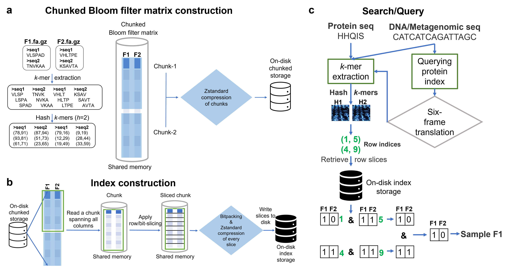

# MetaProFi: An ultrafast chunked Bloom filter for storing and querying protein and nucleotide sequence data for accurate identification of functionally relevant genetic variants

* MetaProFi enables building _k_-mer indexes and allows exact and approximate searching of sequences in a fast and efficient way
* MetaProFi supports both protein and nucleotide (canonical) _k_-mer indexing
* One can use metagenomic reads or contigs or assembled genomes or other protein sequences to search against the index
* MetaProFi allows one to use nucleotide sequences to search against the protein index by performing a six frame translation internally and uses the translated sequences to search the index



## Installation

Install MetaProFi as a command line tool using pip

* Requirement: Linux OS (64 bit)

* Setup:

    * Install miniconda on Linux

      ``` bash
      wget https://repo.anaconda.com/miniconda/Miniconda3-latest-Linux-x86_64.sh &&  Miniconda3-latest-Linux-x86_64.sh
      ```

    * Download this git repo

      ``` bash
      git clone https://github.com/kalininalab/metaprofi.git
      ```

    * Install using pip

      ``` bash
      conda create --name metaprofi python==3.8 pigz
      conda activate metaprofi
      pip install /path/to/metaprofi/git/repo/directory/
      ```

## **Usage**

* Run the following to get the list of available subcommands

  ```
  metaprofi -h
  ```

* Run the following to get MetaProFi version info

  ```
  metaprofi --version
  ```

### **Available subcommands**
|Command|Summary|
|---|---|
|[build](https://github.com/kalininalab/metaprofi#build)|To build Bloom filter matrix and to create index store.|
|[build-seq](https://github.com/kalininalab/metaprofi#build-seq)|To build Bloom filter matrix (every sequence in the input file (FASTA/FASTQ (.GZ)) will be considered as a sample) and to create index store.|
|[update](https://github.com/kalininalab/metaprofi#update)|To build Bloom filter matrix for the new samples and to append/update the index with the new data
|[update-seq](https://github.com/kalininalab/metaprofi#update-seq)|To build Bloom filter matrix for the new samples (every sequence in the input file (FASTA/FASTQ (.GZ)) will be considered as a sample) and to append/update the index with the new data
|[build_matrix](https://github.com/kalininalab/metaprofi#build_matrix)|To build Bloom filter matrix|
|[build_index](https://github.com/kalininalab/metaprofi#build_index)|To build the index|
|[update_index](https://github.com/kalininalab/metaprofi#update_index)|To update index with the new data|
|[search_index](https://github.com/kalininalab/metaprofi#search_index)|To search/query the index|
|[summary](https://github.com/kalininalab/metaprofi#summary)|Extracts summary about the data using the index store|

### **General information**

1. Please make sure to use the hardware with the same endianness during the build, update, and query sessions. Mixing of these is not allowed in MetaProFi.

### **config.yml:**

*MetaProFi requires a `config.yml` file which can be downloaded from [here](https://github.com/kalininalab/metaprofi/blob/master/templates/config.yml) </br> Note: MetaProFi requires same config used for building to be used during updates as well (can increase max_memory and nproc)*

  * `h` => Number of hash functions to apply on each _k_-mer [required]
  * `k` => Size/Length of the _k_-mer [required]
  * `m` => Size of the Bloom filter to use [required]
  * `nproc` => Number of CPU cores to be used by MetaProFi [default: Number of available cores - 1]
  * `max_memory` => Maximum RAM to be used by MetaProFi [default: half of the available RAM] </br> *Note: `max_memory` should always be the same during initial build and updates as well*
  * `sequence_type` => Type of the sequence used for building the index (aminoacid or nucleotide) [required] </br> *NOTE: `sequence_type` is used to determine the type of the index database and also to determine whether six-frame translation needs to be performed on the input during querying*
  * `output_directory` => Path to the output directory for storing Bloom filter matrix, index and the query results (if the directory does not exist, it will be created) [required]
  * `matrix_store_name` => Name of the matrix store directory
  * `index_store_name` => Name of the index store directory

### **Subcommands and its parameters**

#### **build**

Builds Bloom filter matrix and creates index

|Positional|Summary|
|---|---|
|input_file|Input file containing lines each of which specifies a sample identifier and one or more compressed or uncompressed FASTA or FASTQ file path (refer [here](https://github.com/kalininalab/metaprofi#create-a-metaprofi-index-for-all-uniprot-bacterial-sequences) for format) |
|config_file|Path to the configuration file|

  ```
  Example:
  metaprofi build /path/to/input_file.txt /path/to/config.yml
  ```

#### **build-seq**

To build sequence level index (as an alternative to BLAST for example), every sequence in the input file (FASTA/FASTQ (.GZ)) will be considered as a sample and a Bloom filter per sequence will be created in the matrix

*NOTE: Sample identifier will be extracted from the header of each sequence*

|Positional|Summary|
|---|---|
|input_file|Input file can be either a FASTA or a FASTQ (.GZ) file with one or more sequences|
|config_file|Path to the configuration file|

  ```
  Example:
  metaprofi build-seq /path/to/input_file.gz /path/to/config.yml
  ```

#### **update**

To build Bloom filter matrix for the new samples and then to append/update the index with the new data

*NOTES*
1. Looks for the index store directory (`index_store_name` set in the config file) in the `output_directory` path set in the config file
2. Do not forget to change the value of the `matrix_store_name` in the config file for the update

|Positional|Summary|
|---|---|
|input_file|Input file containing lines each of which specifies a sample identifier and one or more compressed or uncompressed FASTA or FASTQ file path (refer [here](https://github.com/kalininalab/metaprofi#create-a-metaprofi-index-for-all-uniprot-bacterial-sequences) for format)|
|config_file|Path to the configuration file|

  ```
  Example:
  metaprofi update /path/to/input_file.txt /path/to/config.yml
  ```

#### **update-seq**

To build Bloom filter matrix for the new samples (every sequence in the input file (FASTA/FASTQ (.GZ)) will be considered as a sample) and then to append/update the index with the new data.

*NOTES*
1. Sample identifier will be extracted from the header of each sequence
2. Looks for the index store directory (`index_store_name` set in the config file) in the `output_directory` path set in the config file
3. Do not forget to change the value of the `matrix_store_name` in the config file for the update

|Positional|Summary|
|---|---|
|input_file|Input file can be either a FASTA or a FASTQ (.GZ) file with one or more sequences|
|config_file|Path to the configuration file|

  ```
  Example:
  metaprofi update-seq /path/to/input_file.gz /path/to/config.yml
  ```

#### **build_matrix**

Alternate function for `build` subcommand. This is used when one wants to create the Bloom filter matrix only and does not wish to create the index immediately.

|Positional|Summary|
|---|---|
|input_file|Input file containing lines each of which specifies a sample identifier and one or more compressed or uncompressed FASTA or FASTQ file path (refer [here](https://github.com/kalininalab/metaprofi#create-a-metaprofi-index-for-all-uniprot-bacterial-sequences) for format)|
|config_file|Path to the configuration file|

  ```
  Example:
  metaprofi build_matrix /path/to/input_file.txt /path/to/config.yml
  ```

#### **build_index**

Alternate function for `build` subcommand. To use this one should first use the `build_matrix` subcommand and build the Bloom filter matrix and then use this subcommand to build the index.

*NOTE: Looks for the matrix store directory (`matrix_store_name` set in the config file) in the `output_directory` path set in the config file*

|Positional|Summary|
|---|---|
|config_file|Path to the configuration file|

  ```
  Example:
  metaprofi build_index /path/to/config.yml
  ```

#### **update_index**

To append/insert new data to the index. First, one should use the `build_matrix` subcommand to build the Bloom filter matrix for the new data and then use this subcommand to append/update the index with the new data.

*NOTE: Looks for the matrix store directory (`matrix_store_name` set in the config file) and the index store directory (`index_store_name` set in the config file) in the `output_directory` path set in the config file*

|Positional|Summary|
|---|---|
|config_file|Path to the configuration file|

  ```
  Example:
  metaprofi update_index /path/to/config.yml
  ```

#### **search_index**

Search/Query the sequence against the index

|Positional|Summary|
|---|---|
|config_file|Path to the configuration file|

|Flags|Summary|Required|Default|
|---|---|---|---|
|-s|Provide an input sequence (nucleotides/aminoacids) to search against the index </br> *NOTE: Use either -s or -f flag and not both*|Yes (Check Note)*|None|
|-f|Provide an input FASTA/FASTQ (.GZ) file containing sequence(s) to search against the index </br> *NOTE: Use either -s or -f flag and not both*|Yes (Check Note)*|None|
|-i|Provide the type of the query sequence (e.g., *nucleotide* or *aminoacid*)|Yes|None|
|-t|Provide a threshold value to invoke approximate search (e.g., 50) </br> *NOTE: Number should be between 1 and 100*|No|100

  ```
  Example1: Search for a sequence where at least 50% of k-mers are found (approximate search)
  metaprofi search_index -s 'AGCCGGCCCGCCCGCCCGGGTCTGACC' -i nucleotide -t 50

  Example2: Search for a sequence where at least 75% of k-mers are found (approximate search)
  metaprofi search_index -s 'HIMHLIHIRAFFLDYNIYCIHRFNQSHRA' -i aminoacid -t 75

  Example3: Search for all sequences in the FASTA file (exact search)
  metaprofi search_index -f input_protein.fasta -i aminoacid -t 100

  Example4: Search for all sequences in the FASTQ file (exact search)
  metaprofi search_index -f input_dna.fastq -i nucleotide -t 100

  Results: Can be found in a file named 'metaprofi_query_results_<datetime>_t<threshold>.txt' in the output directory path set in the config file*
  ```

*NOTE: `sequence_type` in the config file will be used to determine if we are searching against the aminoacid or nucleotide index and to determine whether six frame translation needs to be performed on the input if nucleotide query is used*

#### **summary**

To get summary about the data

*NOTE: Looks for the index store directory (`index_store_name` set in the config file) in the `output_directory` path set in the config file*

|Positional|Summary|
|---|---|
|config_file|Path to the configuration file|

  ```
  Example:
  metaprofi summary /path/to/config.yml
  ```

## Full example:

### Create a MetaProFi index for all UniProt bacterial sequences

* Download all bacterial protein sequences from UniProt

* Process the sequences (Create one _filename.fasta_ file per bacterial species and put all related sequences together)

* Create a input file `input_file.txt` (.GZ supported)

  * One sample per line
  * Each line should contain only one sample identifier followed by the path of one or more compressed or uncompressed FASTA or FASTQ file(s)
  * Lines starting with a '`#`' will be considered as a comment and will be skipped/ignored
  * Different possible accepted `input_file.txt` example is given below

    ```
    # This line will be treated as a comment
    sample_id1: /path/to/filename1.FASTA; /path/to/filename2.FASTA; /path/to/filename3.FASTA
    sample_id2: /path/to/filename4.FASTA; /path/to/filename5.FASTA
    sample_id3: /path/to/filename6.FASTA
    ```

  * MetaProFi sorts (ascending) the samples in the input file based on their storage size
  * MetaProFi discards samples that does not contain at least one _k_-mer
  * MetaProFi discards sequences that are smaller than _k_-mer size

* Prepare `config.yml` refer [here](https://github.com/kalininalab/metaprofi#configyml)

  * How to choose the size of the Bloom filter (m)

    ```
    # Example
    from math import ceil, log
    n = 10**5
    p = 0.01
    m = ceil((n * log(p)) / log(1 / pow(2, log(2))))

    where,
    n = Maximum number of k-mers expected in any dataset
    p = Probability of false positives (fraction between 0 and 1)
    NOTE: Smaller the probability of false positive (p) larger the size of the Bloom filter (m)
    ```

  * How to choose the number of hash functions (h)

    ```
    # Example
    from math import log
    m = 10**6
    n = 10**5
    h = round((m / n) * log(2))

    where,
    m = Size of the Bloom filter
    n = Maximum number of k-mers expected in any dataset
    ```

  * To find the size of the Bloom filter given the maximum number of _k_-mers expected in any dataset (n), number of hash functions (h) and the false positive rate (p)

    ```
    # Example
    from math import ceil, log, exp
    n = 10**5
    h = 2
    p = 0.01
    m = ceil(n * (-h / log(1 - exp(log(p) / h))))

    where,
    n = Maximum number of k-mers expected in any dataset
    p = Probability of false positives (fraction between 0 and 1)
    h = Number of hash functions to apply on each k-mer
    NOTE: Size of the Bloom filter is directly proportional to the amount of storage required in a regular Bloom filter (MetaProFi uses packed Bloom filters and compression algorithms to reduce the storage requirements)
    ```

  * To find the number of false positives per query given the expected number of samples (N), maximum number of acceptable false positives per query (pqmax), size of the _k_-mer (_k_), and shortest length of the query sequence to be used (qlmin)

    ```
    # Example
    N = 10**5
    k = 11
    pqmax = 10**-5
    qlmin = 50

    per_query_false_positives = N * ((pqmax / N) ** (1 / (qlmin - k + 1))) ** (qlmin - k + 1)

    where,
    N = The expected number of samples (datasets)
    pqmax = Maximum number of acceptable false positives per query
    k = Size of the k-mer
    qlmin = Shortest length of the query sequence to be used
    NOTE: qlmin must be greater than or equal to k
    ```

* To build Bloom filter matrix and index

  ```
  metaprofi build /path/to/input_file.txt /path/to/config.yml
  ```

  *NOTE: Alternately one can use `build_matrix` subcommand to build the Bloom filter matrix first and then use `build_index` subcommand to create the index later*

* To query the index refer the available examples in [search_index](https://github.com/kalininalab/metaprofi#search_index) subcommand

## How to cite us

- If you find this tool useful, please cite:

```
Sanjay K. Srikakulam, Sebastian Keller, Fawaz Dabbaghie, Robert Bals, Olga V. Kalinina MetaProFi: A protein-based Bloom filter for storing and querying sequence data for accurate identification of functionally relevant genetic variants. Submitted
```